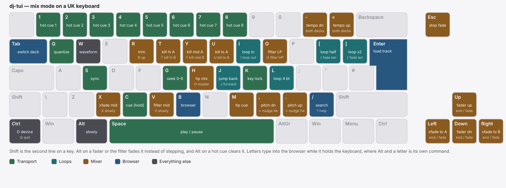
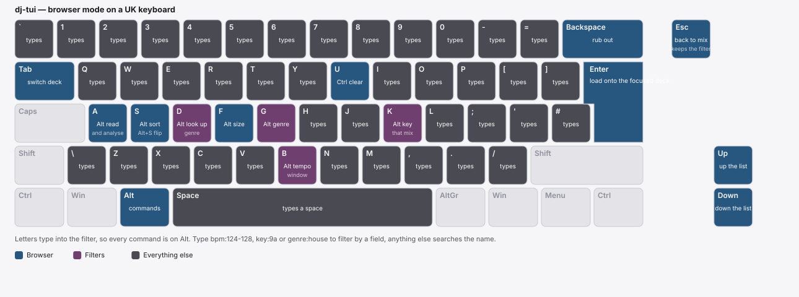

# Controls

The keyboard has two layers. Mix mode is where you start.

Browser mode, on `b` or `/`, hands the whole keyboard to the track list: letters type into the
filter, so every command moves onto `Alt`. `Esc` gives it back in one press.

One row per key below. `Shift`, `Alt` or `Ctrl` change how far a key travels.

## Transport

| Key | What it does |
| --- | --- |
| `Space` | Play or pause the focused deck. |
| `c` | Cue. Hold to preview from the cue point, release to snap back. |
| `1`–`8` | Hot cue: jump to it, or set it where the pad is empty. |
| `Alt+1`–`Alt+8` | Clear a hot cue. |
| `g` then `0`–`9` | Seek to that tenth of the track. |
| `-` / `+` | Ride both decks' tempo together by the same proportion, so a beatmatched pair stays matched. `Alt` gives a fine step. |
| `,` / `.` | The focused deck's own pitch, down and up, with `Alt` for a fine step. |
| `<` / `>` | Nudge the playhead back and forward, for matching by ear. |
| `s` | Sync. First press matches the other deck's tempo, second lines the beats up. |
| `k` | Key lock: hold the pitch where it is while the tempo fader moves. |
| `q` | Quantize: snap loop points and beat jumps to the beat grid. |
| Left click on a waveform | Seek there. |

Sync needs something running to follow. When the other deck's track ends it stops being a
timing reference, and the deck still playing keeps its own time.

## Loops

| Key | What it does |
| --- | --- |
| `l` | Four-beat loop on and off. |
| `i` | Mark the loop in point. |
| `I` | Close the loop where the playhead is, which also sets the length. |
| `[` / `]` | Halve and double the loop, keeping the in point. |
| `j` / `J` | Beat jump back by the loop length, forward with Shift. |

A loop marked by hand needs no beat grid, so it works on anything. The running loop is saved
with the track and comes back the next time you load it.

## Mixer

| Key | What it does |
| --- | --- |
| `←` / `→` | Crossfader, one step. |
| `Shift+←` / `Shift+→` | Crossfader hard to that end. |
| `x` | Crossfader back to the middle. |
| `↑` / `↓` | The focused deck's channel fader one step, in dB. |
| `Shift+↑` / `Shift+↓` | That fader hard to full or to zero. |
| `r` / `R` | Trim down, and up with Shift. |
| `t` / `y` / `u` | Kill the lows, mids, highs on deck A. A press toggles, so pressing again gives the band back. |
| `T` / `Y` / `U` | The same three kills on deck B. |
| `o` / `O` | Master filter toward low-pass, and toward high-pass with Shift. |
| `v` | Master filter back to the middle. |
| `m` | Headphone cue on the focused channel. Each deck toggles on its own, so cueing both sends both to the headphones. The `CUE` dots in the mixer fill to show which are on. |
| `h` / `H` | Headphone mix, from the cue bus toward the master with Shift. It starts halfway, so the headphones carry an even blend of the cue and the master until you move it. Five presses of `h` reaches cue only. |

## Fades

Every automated fade runs over the fade length, shown as `FADE 8b` on the crossfader row.

| Key | What it does |
| --- | --- |
| `Alt+←` / `Alt+→` | Crossfader fades to that end. |
| `Alt+↑` / `Alt+↓` | The focused deck's fader fades to full or to silence. |
| `Alt+o` / `Alt+O` | Master filter sweeps toward low-pass or high-pass. |
| `X` | Crossfader fades back to the middle. |
| `V` | Master filter sweeps back to the middle. |
| `{` / `}` | Halve and double the fade length. |
| `Esc` | Stop every running fade where it stands. |

## Browser

`b` and `/` both open the track list. See [the browser](browser.md) for what the filters do.

| Key | What it does |
| --- | --- |
| `b` | The browser, full screen, keeping whatever filter is on. |
| `/` | The browser beside the decks, with the filter cleared. |
| `Enter` | Load the selected track onto the focused deck. |
| `Backspace` | Edit the filter. |
| `Alt+s` / `Alt+S` | Change the sort column, and with Shift the direction. |
| `Alt+a` | Work through the list: read tags, look up what the tags left blank, then analyse. Press it again to stop. |
| `Alt+b` | A tempo window around the playing deck: off, within 3 %, within 6 %. Half and double time count. |
| `Alt+k` | Show only the keys that would mix with the playing deck's. |
| `Alt+g` | Cycle the genres your library holds, and back to off. |
| `Alt+d` | Ask Discogs about the selected track's genre. |
| `Alt+f` | Swap between full screen and the panel beside the decks. |
| `Ctrl+u` | Clear the filter. |
| `Esc` | Back to mix mode. |

## Modes and display

| Key | What it does |
| --- | --- |
| `Tab` | Switch focused deck, in every mode, which is what picks where `Enter` sends a track. |
| `w` | Waveform colour mode: 3-Band, RGB, Blue. Shift does the same thing. |
| `?` | The key list. |
| `Ctrl+D` | The audio device screen, where `↑` / `↓` and `Enter` choose a card. `Esc` leaves it. |
| `Ctrl+Q` | Quit, from any mode. |
